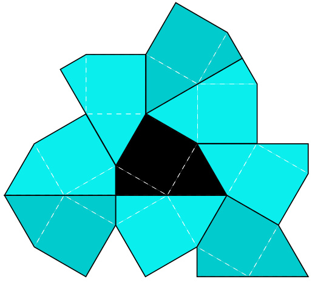
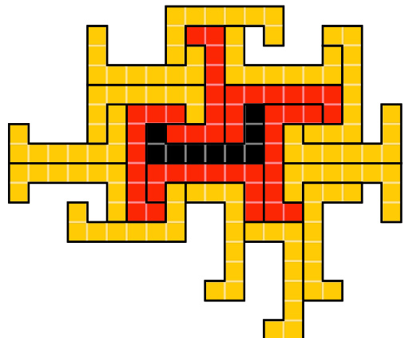
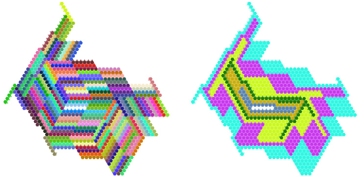

2024 Certificate Authority Cup International Mathematical Contest Modeling http://mcm.tzmcm.cn  

# Problem B (MCM) A Large Finite Heesch Number  

The class of problems known as planar tilings involves the use of a single polygon, which is rotated, translated and mirrored in order to tile the entire plane without any gaps or overlaps. Some polygons are capable of being tiled, such as squares, whereas others are not, such as pentagons. We shall now focus on those polygons that are unable to be tiled.  

To illustrate, when a pentagon is positioned within a plane, it is not feasible to utilise the same pentagon to enclose its entire circumference without leaving gaps. However, there are polygons that can be constructed in such a way that they cover their circumference(corona) without leaving gaps, but which cannot be continued. An example of this is the figure constructed by Heinrich Heesch in 1968.  

  
Additionally, there are polygons that can be extended to encompass an additional week of edges, yet cannot be extended further. This is exemplified by the graph constructed by Anne Fontaine in 1991[1].  

  

In this context, the maximum number of circles that can be filled is referred to as the Heesch number.  

The formal mathematical definition is as follows[2]: A tessellation of the plane is defined as a partition of the plane into smaller regions, or tiles. The zeroth corona of a tile is defined as the tile itself. For $k>0$ , the $k$ th corona is defined as the set of tiles sharing a boundary point with the $(k-1)$ th corona. The Heesch number of a given figure $S$ is defined as the maximum value of $k$ for which a tessellation of the plane into smaller regions, called tiles, exists. The Heesch number of a figure $S$ is defined as the maximum value $k$ such that there exists a tiling of the plane and a tile $t$ within that tiling, for which all tiles in the zeroth through $k$ th coronas of $t$ are simply connected regions. This definition is modified in some work on this problem to additionally require that the union of the zeroth through $k$ th coronas of $t$ is a simply connected region.  

The objective of Heesch’s problem is to ascertain the theoretical maximum Heesch number. The maximum known Heesch number is 6, as illustrated in the following graph constructed by Bojan Basˇic´ in 2020[3].  

  

# Tasks:  

1. The objective is to construct an efficient mathematical model and an algorithm that enables the creation of polygons with the largest possible Heesch number. The paper should describe the principles of the algorithm and the implementation process in detail, as well as the final result. It is not necessary to achieve or exceed the best-known results; however, it is satisfactory if the algorithm automatically produces the largest possible result.  

2. Please give an estimate of the upper bound on the complexity of the algorithm.  

# References  

[1] Fontaine, Anne. ”An infinite number of plane figures with Heesch number two”. Journal of Combinatorial Theory. Series A. 57 (1): 151156, 1991.   
[2] https://en.wikipedia.org/wiki/Heesch\%27s_problem   
[3] Basˇic´, Bojan. ”A Figure with Heesch Number 6: Pushing a Two-DecadeOld Boundary”. The Mathematical Intelligencer. 43 (3): 5053, 2021.  